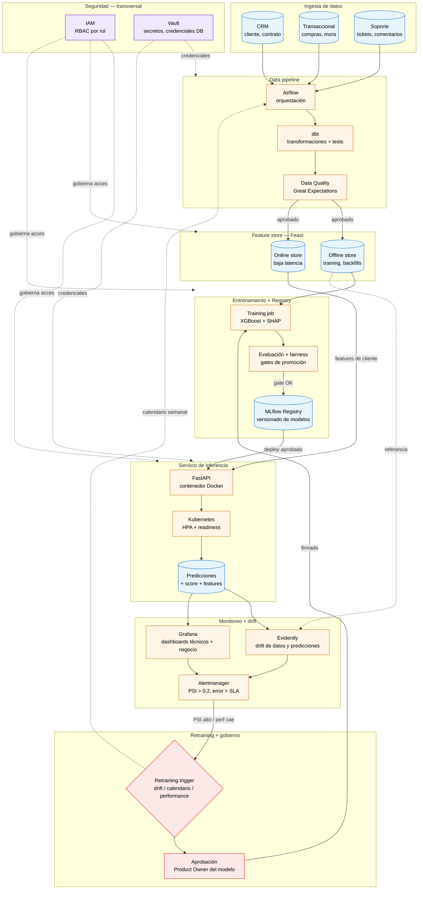
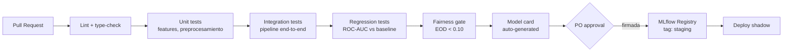

# Arquitectura de Producción — Modelo de Churn

> Parte 4 de la prueba técnica. Diagrama de flujo + tabla de decisiones operativas.

## Diagrama (Mermaid)

### Lectura rápida del flujo

1. **CRM, Transaccional y Soporte** alimentan **Airflow** (orquestador). **dbt** transforma + **Great Expectations** valida calidad antes de que cualquier dato toque el feature store.
2. **Feast** mantiene dos caras: offline (para entrenamiento + backfills consistentes) y online (lookup de baja latencia para inferencia).
3. El **training job** consume features offline, entrena con XGBoost, evalúa contra **gates de promoción** (performance + fairness). Solo si pasa, el modelo se registra en **MLflow**.
4. **FastAPI** (containerizado, Kubernetes con HPA) sirve predicciones leyendo features del online store.
5. Cada predicción se persiste y alimenta **Evidently** (drift) y **Grafana** (dashboards).
6. **Alertmanager** dispara el **retraining trigger** ante PSI alto o degradación; un humano (PO del modelo) aprueba antes de reentrenar.
7. **IAM + Vault** atraviesan todo: nadie accede a datos sin rol, nadie usa credenciales en texto plano.

---

## Tabla de decisiones operativas

| Decisión | Elección | Justificación (1 línea) |
|---|---|---|
| **Batch vs. tiempo real** | **Batch diario** (con capacidad de on-demand para casos comerciales puntuales) | Las features dominantes (`days_since_last_purchase`, `payment_delay_days`, `digital_engagement_score`) cambian lento; el costo y la complejidad operativa de tiempo real no se justifican porque la acción comercial humana tarda > 24h. |
| **Frecuencia de scoring** | **Diaria, ventana 02:00 a 04:00 local** (después del cierre de operaciones) | Coincide con la ventana de planificación comercial del día siguiente; un score más fresco no agrega valor si la acción retentiva no se ejecuta antes de 24h. |
| **Métricas de drift** | **PSI > 0.2 en cualquiera de las top-5 features** (`days_since`, `payment_delay`, `engagement`, `tickets`, `monthly_spend`) + **KS-test en distribución de scores** + **caída de PR-AUC > 5 pp** vs. baseline | PSI no requiere labels (que tardan 30–60 días en confirmarse en churn), captura cambios de población temprano; combinado con drift de scores detecta concept drift sin esperar el ground truth. |
| **Gobierno de cambios** | **PR obligatorio + code review + gate de fairness automático + aprobación del Product Owner del modelo + comité mensual de auditoría** | Cualquier cambio en el modelo afecta decisiones comerciales sobre clientes reales; sin accountability humana (PO firmando promoción) el modelo se vuelve un riesgo legal y reputacional. |
| **Documentación** | **Model Card en MLflow** (features, performance, fairness, threshold, fecha) + **diagrama de arquitectura versionado en repo** + **changelog automático** generado de cada PR de feature o modelo + **runbook de incidentes** | Permite onboarding rápido, auditoría regulatoria, y debugging post-mortem: sin Model Card el siguiente equipo tarda 3 semanas en entender qué hace el modelo y por qué. |

---

## Estrategia de despliegue

**No se hace "deploy aprobado" sin más** — un cambio de modelo afecta decisiones comerciales sobre clientes reales. Despliegue por capas con validación incremental:

| Etapa | Tráfico | Duración | Criterio de pase |
|---|---|---|---|
| **Shadow** | 0% (predice pero no se actúa) | 5–7 días | Distribución de scores coincide con baseline (PSI < 0.1) + sin errores 5xx |
| **Canary** | 5% de clientes | 3–5 días | ROC-AUC bootstrap CI ≥ baseline 95% inferior, latencia p95 < SLA, fairness EOD < 0.10 |
| **Ramp** | 25% → 50% → 100% | 1 semana por escalón | Misma puerta de calidad en cada escalón. Si alguna métrica regresa, **rollback automático**. |

**Rollback automático** disparado por: error rate > 1% sobre 5 min, latencia p95 > SLA por 10 min, drift de predicciones (KS > 0.15) en ventana de 1h, o caída de PR-AUC > 5 pp en muestra etiquetada.

**Blue/green a nivel de pipeline**: el modelo previo queda servido en paralelo durante 30 días post-promoción. Volver atrás es flip de un load balancer, no un re-deploy.

## CI/CD del modelo

**Reglas duras:**
- Cualquier PR que toque `src/` o features corre el pipeline completo en CI.
- **Regression gate**: si la nueva ROC-AUC (en CV bootstrap) cae bajo el límite inferior del CI 95% del modelo en producción, **el merge se bloquea automáticamente**.
- **Fairness gate**: si Equal Opportunity Difference > 0.10 en cualquier grupo protegido, bloquea merge.
- Cobertura mínima de tests: 80% sobre `src/features.py` y `src/train.py`. Tests obligatorios sobre transformaciones (no sobre el modelo en sí).
- Re-entrenamiento programado (semanal o por drift) corre como GitHub Actions schedule, pero la PROMOCIÓN a producción siempre requiere firma humana.

## SLAs

| Métrica | Objetivo | Cómo se mide |
|---|---|---|
| **Latencia p95 inferencia (online)** | < 150 ms | Trace por request en Grafana, percentil sobre ventana 5 min |
| **Latencia p99 inferencia (online)** | < 400 ms | Idem |
| **Throughput máximo sostenido** | 500 req/s por pod, HPA hasta 8 pods | Load test trimestral con k6 o Locust |
| **Disponibilidad (uptime)** | 99.5% mensual (≈ 3.6 h downtime/mes permitido) | Synthetic checks cada 30 s + Grafana SLO panel |
| **Ventana batch scoring** | Completa antes de las 04:00 local | Airflow SLA miss notification → PagerDuty |
| **Frescura de features** | Online store actualizado < 6 h | Métrica de freshness por feature en Feast |

Cualquier breach sostenido > 15 min: ticket P2 automático al equipo de plataforma de IA.

## Estimación de costos

Orden de magnitud para 1M de clientes activos, batch diario + online API para consultas comerciales (~10K req/día):

| Concepto | Stack managed (AWS/GCP) | Stack self-hosted (Kubernetes propio) |
|---|---|---|
| Feature store (Feast + Redis online) | $200–400 / mes | ~$80 / mes infra |
| Training (1 job semanal, m5.2xlarge) | $40 / mes | Incluido en infra |
| Inferencia API (3 pods, HPA hasta 8) | $250–500 / mes | ~$150 / mes infra |
| Vector DB (RAG) — 100K chunks | $150 / mes (Pinecone starter) | $50 / mes (Qdrant self-hosted) |
| LLM (RAG, ~30K queries/mes) | $400–800 / mes (Claude Sonnet o GPT-4o) | $200 / mes infra para Llama 70B vLLM (en pod compartido) |
| Observabilidad (Langfuse/Grafana/Evidently) | $200 / mes | $50 / mes infra |
| **Total mensual** | **$1.2k–2.3k / mes** | **$530–600 / mes** |

**ROI:** ratio breakeven asumiendo LTV cliente = $150, churn base = 15%, uplift = 5 pp: cada 1000 clientes salvados/mes = $150K revenue retenida. El stack más caro se paga con 16 clientes salvados/mes. Es muy difícil que no cierre.

## Runbook de incidentes (P1)

> **Síntoma**: predicciones colapsan a 0 o 1, o ROC-AUC live < 0.7, o latencia p95 > 1s.

1. **Inmediato (≤ 5 min)**: Alertmanager dispara → on-call recibe en PagerDuty.
2. **Rollback (≤ 10 min)**: flip del load balancer al modelo anterior (blue/green). Confirmar con tráfico restaurado y métricas estables.
3. **Diagnóstico (≤ 1 h)**: comparar feature distributions live vs. baseline (PSI por feature). Revisar logs de pipeline (¿upstream cambió esquema? ¿fuente caída?). Verificar versión del modelo y del feature definitions.
4. **Post-mortem (≤ 48 h)**: documento sin culpables. Causa raíz + acción correctiva + actualización del runbook si el modo de falla es nuevo.
5. **Comunicación**: si afectó decisiones comerciales (campañas erróneas), notificar a Retención + Legal dentro de 24 h.

## Versionado de features

**Cada feature tiene un schema versionado en el feature store (Feast feature view).**

- Cambiar la definición de una feature existente (ej. nueva fórmula para `spend_per_day`) requiere **crear una nueva versión** (`spend_per_day_v2`), no sobrescribir.
- El modelo declara explícitamente qué versión consume (model card lista `spend_per_day@v1`).
- **Backfill obligatorio**: cuando se introduce `spend_per_day_v2`, se calcula históricamente sobre todo el ventana de entrenamiento antes de que cualquier modelo nuevo pueda consumirlo.
- **Sunset**: una versión deprecada se mantiene viva mientras haya un modelo en producción que la consuma. Eliminación coordinada con la salida del último modelo dependiente.
- Esto evita el desastre clásico: cambiar la definición → backfill ausente → modelo entrenado con la nueva semántica pero sirviendo con la vieja → drift silencioso.
