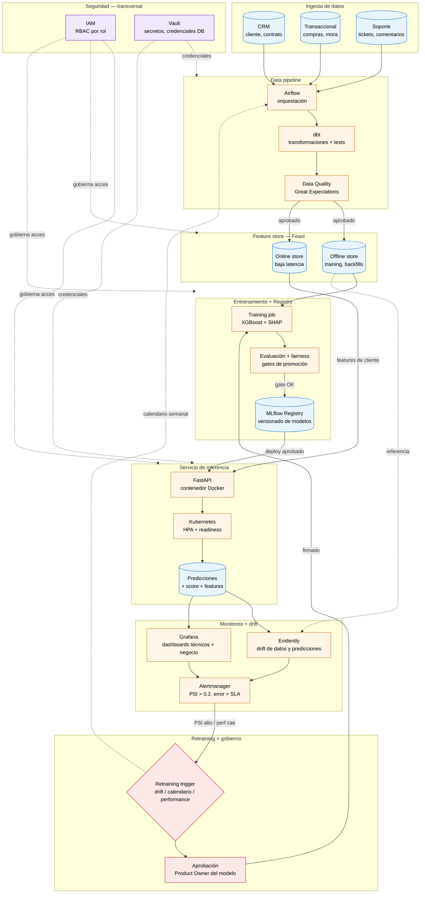

# Arquitectura de Producción — Modelo de Churn

> Parte 4 de la prueba técnica. Diagrama de flujo + tabla de decisiones operativas.

## Diagrama (Mermaid)

### Lectura rápida del flujo

1. **CRM, Transaccional y Soporte** alimentan **Airflow** (orquestador). **dbt** transforma + **Great Expectations** valida calidad antes de que cualquier dato toque el feature store.
2. **Feast** mantiene dos caras: offline (para entrenamiento + backfills consistentes) y online (lookup de baja latencia para inferencia).
3. El **training job** consume features offline, entrena con XGBoost, evalúa contra **gates de promoción** (performance + fairness). Solo si pasa, el modelo se registra en **MLflow**.
4. **FastAPI** (containerizado, Kubernetes con HPA) sirve predicciones leyendo features del online store.
5. Cada predicción se persiste y alimenta **Evidently** (drift) y **Grafana** (dashboards).
6. **Alertmanager** dispara el **retraining trigger** ante PSI alto o degradación; un humano (PO del modelo) aprueba antes de reentrenar.
7. **IAM + Vault** atraviesan todo: nadie accede a datos sin rol, nadie usa credenciales en texto plano.

---

## Tabla de decisiones operativas

| Decisión | Elección | Justificación (1 línea) |
|---|---|---|
| **Batch vs. tiempo real** | **Batch diario** (con capacidad de on-demand para casos comerciales puntuales) | Las features dominantes (`days_since_last_purchase`, `payment_delay_days`, `digital_engagement_score`) cambian lento; el costo y la complejidad operativa de tiempo real no se justifican porque la acción comercial humana tarda > 24h. |
| **Frecuencia de scoring** | **Diaria, ventana 02:00 a 04:00 local** (después del cierre de operaciones) | Coincide con la ventana de planificación comercial del día siguiente; un score más fresco no agrega valor si la acción retentiva no se ejecuta antes de 24h. |
| **Métricas de drift** | **PSI > 0.2 en cualquiera de las top-5 features** (`days_since`, `payment_delay`, `engagement`, `tickets`, `monthly_spend`) + **KS-test en distribución de scores** + **caída de PR-AUC > 5 pp** vs. baseline | PSI no requiere labels (que tardan 30–60 días en confirmarse en churn), captura cambios de población temprano; combinado con drift de scores detecta concept drift sin esperar el ground truth. |
| **Gobierno de cambios** | **PR obligatorio + code review + gate de fairness automático + aprobación del Product Owner del modelo + comité mensual de auditoría** | Cualquier cambio en el modelo afecta decisiones comerciales sobre clientes reales; sin accountability humana (PO firmando promoción) el modelo se vuelve un riesgo legal y reputacional. |
| **Documentación** | **Model Card en MLflow** (features, performance, fairness, threshold, fecha) + **diagrama de arquitectura versionado en repo** + **changelog automático** generado de cada PR de feature o modelo + **runbook de incidentes** | Permite onboarding rápido, auditoría regulatoria, y debugging post-mortem: sin Model Card el siguiente equipo tarda 3 semanas en entender qué hace el modelo y por qué. |
