# Asistente Interno — Arquitectura RAG

> Parte 5 de la prueba técnica. Asistente de IA generativa para el equipo interno (comercial, soporte, cuentas), apoyado en una base de conocimiento corporativa y opcionalmente en datos de cliente.

## 1. Diagrama de flujo (Mermaid)

```mermaid
flowchart TD
    USER([Usuario interno<br/>agente comercial / soporte])

    %% =================== GUARDRAILS DE ENTRADA ===================
    subgraph IN_GR["Guardrails de entrada"]
        AUTH[Auth + RBAC<br/>¿quién pregunta?]
        PII_IN[Detector PII en query<br/>Presidio + regex]
        INJECT[Detector prompt injection<br/>clasificador]
        TOPIC[Clasificador de tópico<br/>permitido / escalar / bloquear]
    end

    %% =================== RETRIEVAL ===================
    subgraph RETR["Retrieval"]
        REWRITE[Query rewriting<br/>LLM pequeño / HyDE]
        EMB[Embeddings<br/>text-embedding-3-large]
        VDB[(Vector DB<br/>Qdrant / Pinecone)]
        RERANK[Re-ranker<br/>Cohere Rerank / cross-encoder]
        SIMGATE{¿Similaridad<br/>top-k > 0.5?}
    end

    %% =================== GENERACIÓN ===================
    subgraph GEN["Generación + contexto"]
        ASSEMBLE[Context assembly<br/>chunks + metadata + citas]
        LLM[LLM<br/>Claude Sonnet / GPT-4o]
        CITE[Citation enforcer<br/>cada claim → fuente]
    end

    %% =================== GUARDRAILS DE SALIDA ===================
    subgraph OUT_GR["Guardrails de salida"]
        PII_OUT[Redacción PII en respuesta]
        FAITH[Faithfulness check<br/>NLI vs. contexto]
        TOXIC[Toxicidad + tono]
        ABSTAIN{¿Pasa<br/>todos los checks?}
    end

    %% =================== RESPUESTA ===================
    HUMAN[Escalar a humano<br/>HITL]
    REPLY([Respuesta al usuario<br/>con citas])
    LOG[(Audit log<br/>query + retrieval + respuesta)]

    %% =================== FLUJOS ===================
    USER --> AUTH
    AUTH --> PII_IN
    PII_IN --> INJECT
    INJECT --> TOPIC
    TOPIC -->|permitido| REWRITE
    TOPIC -->|escalar| HUMAN
    TOPIC -.bloquear.-> LOG

    REWRITE --> EMB
    EMB --> VDB
    VDB --> RERANK
    RERANK --> SIMGATE
    SIMGATE -->|sí| ASSEMBLE
    SIMGATE -->|no| HUMAN

    ASSEMBLE --> LLM
    LLM --> CITE
    CITE --> PII_OUT
    PII_OUT --> FAITH
    FAITH --> TOXIC
    TOXIC --> ABSTAIN
    ABSTAIN -->|sí| REPLY
    ABSTAIN -->|no| HUMAN

    REPLY --> LOG
    HUMAN --> LOG

    %% =================== ESTILOS ===================
    classDef guardrail fill:#fde8e8,stroke:#cc0000,color:#000
    classDef storage fill:#e8f4fd,stroke:#0066cc,color:#000
    classDef compute fill:#fff4e6,stroke:#cc6600,color:#000
    classDef terminal fill:#e8fde8,stroke:#006600,color:#000
    class AUTH,PII_IN,INJECT,TOPIC,PII_OUT,FAITH,TOXIC,SIMGATE,ABSTAIN,CITE guardrail
    class VDB,LOG storage
    class REWRITE,EMB,RERANK,ASSEMBLE,LLM compute
    class USER,REPLY,HUMAN terminal
```



**Principios del flujo:**
- **Cuatro guardrails de entrada** (auth, PII, inyección, tópico) y **cuatro de salida** (redacción PII, faithfulness, toxicidad, abstención). Es deliberadamente paranoico — un asistente interno con acceso a datos de cliente justifica el costo.
- **Dos puertas de abstención**: similaridad insuficiente (no encontramos nada relevante) y `ABSTAIN` (la respuesta no pasa checks). Ambas escalan a humano, no inventan.
- **Audit log de TODO**: query, retrieval, respuesta, decisión de guardrail. No-negociable para auditoría y para fine-tuning posterior.

---

## 2. Componentes y stack

| Componente | Rol | Tecnología sugerida (managed) | Alternativa open-source |
|---|---|---|---|
| **Auth + RBAC** | Identifica al usuario y limita qué documentos puede ver | Auth0, Okta, AWS Cognito | Keycloak |
| **Detector PII** | Filtra PII en query y respuesta | Microsoft Presidio (managed-friendly), AWS Comprehend | **Presidio** + spaCy NER en español |
| **Detector prompt injection** | Clasificador binario sobre la query | Lakera Guard, Prompt Armor | `protectai/deberta-v3-base-prompt-injection-v2` (HF) |
| **Query rewriting** | Reformula la query (multi-query / HyDE) para mejorar recall | LLM ligero (Haiku, GPT-4o-mini) | Llama 3.1 8B local |
| **Embeddings** | Vectoriza chunks y queries | OpenAI `text-embedding-3-large` (3072d) | **`intfloat/multilingual-e5-large`** (cubre español) o `BAAI/bge-m3` |
| **Vector DB** | Almacena embeddings + metadata, búsqueda ANN | Pinecone, Weaviate Cloud | **Qdrant** (self-hosted), Milvus |
| **Re-ranker** | Re-ordena top-k del vector DB para precisión | Cohere Rerank v3 | `BAAI/bge-reranker-v2-m3` (cross-encoder) |
| **LLM** | Genera respuesta condicionada al contexto recuperado | **Claude Sonnet 4.6** (precisión, citaciones nativas) o GPT-4o | **Llama 3.1 70B Instruct** (vía vLLM o TGI) |
| **Faithfulness check** | Verifica que cada claim de la respuesta esté en el contexto (NLI) | Patronus AI, Vectara HHEM | `MoritzLaurer/DeBERTa-v3-large-mnli-fever-anli-ling-wanli` |
| **Guardrails framework** | Orquesta los checks (declarativo) | NVIDIA NeMo Guardrails, Guardrails AI | **Guardrails AI** (open-source), NeMo (open-source) |
| **Orquestación** | Pega todo: chains, agentes, retries | LangSmith (managed) | **LlamaIndex** o LangChain (open-source) |
| **Observabilidad** | Trazas distribuidas, costo por query, latencias | Langfuse Cloud, LangSmith | **Langfuse** (self-hosted), OpenTelemetry |
| **Evaluación continua** | RAGAS, golden set, regression tests | Patronus, Arize Phoenix | **RAGAS**, **Phoenix** |

**Recomendación de stack inicial (MVP en 90 días):**
- Managed: Auth0 + OpenAI embeddings + Pinecone + Claude Sonnet + Langfuse → **menor time-to-value, más caro/mes**.
- Open-source: Keycloak + e5-multilingual + Qdrant + Llama 3.1 70B + Langfuse self-hosted → **más fricción operativa, datos nunca salen, ~10× más barato a escala**.
- Decisión depende de: criticidad de PII (¿podemos enviar datos a OpenAI/Anthropic?) y madurez del equipo de plataforma.

---

## 3. Información que NO debe entrar al LLM

### Categorías prohibidas

| Categoría | Ejemplos | Justificación |
|---|---|---|
| **PII identificadora directa** | Nombre completo + ID/cédula, dirección, teléfono, email | Riesgo legal y de fuga si el LLM es de tercero. |
| **Datos financieros sensibles** | Número de tarjeta, CVV, IBAN, saldo, ingresos declarados | Cumplimiento PCI-DSS y políticas internas de finanzas. |
| **Credenciales** | Tokens API, passwords, claves, cookies de sesión | Riesgo de exfiltración a logs del proveedor LLM. |
| **Datos de salud, judiciales, biométricos** | Cualquier categoría protegida por ley local | Aplican leyes especiales (HIPAA / LFPDPPP / GDPR art. 9). |
| **Información de menores** | Cualquier registro con edad < 18 | Marco legal estricto. |
| **Datos de terceros no autorizados** | Información de empleados, proveedores, datos heredados sin consentimiento | El usuario interno puede tener acceso operativo, no autorización de exposición a LLM. |
| **Estrategia confidencial** | Roadmap de producto, M&A, salarios, márgenes por línea | Riesgo competitivo si el proveedor LLM entrena con esos datos. |

### Cómo se filtra (defensa en profundidad)

**Capa 1 — Regex + diccionarios** (rápido, alta precisión, baja recall):
- Patrones para tarjeta de crédito (Luhn), email, teléfono, IBAN, CURP/cédula.
- Listas negras de términos confidenciales (proyectos internos, código de cliente VIP).
- Bloqueante: si matchea, se redacta automáticamente con `[REDACTED:PII_TYPE]` antes de cualquier inferencia.

**Capa 2 — NER clasificador (Presidio + spaCy multilingüe)** (más lento, captura lo que regex pierde):
- Detecta nombres propios, organizaciones, ubicaciones en texto natural.
- Confianza < 0.7 → escala a humano en lugar de procesar.

**Capa 3 — Clasificador de tópico** (LLM ligero o modelo entrenado):
- Detecta queries que *pidan* datos sensibles ("dame el salario de Juan", "muéstrame las tarjetas registradas").
- Rechazo explícito con mensaje pedagógico al usuario.

**Capa 4 — Política de datos (no técnica)**:
- **Los documentos del corpus se sanean ANTES de indexarse** en el vector DB. No se confía en filtrar en runtime — se filtra en ingesta. Pipeline de indexación con dbt + Presidio antes de generar embeddings.
- Documentos clasificados como "confidencial M&A" o "estrategia" simplemente **no entran al índice**, aunque existan en el repositorio interno.
- Acceso por RBAC: el `top_k` del retrieval se filtra por documentos visibles para el rol del usuario que pregunta.

**Capa 5 — Redacción en salida**:
- Aunque la entrada esté limpia, el LLM puede regurgitar PII memorizada o fabricarla. Misma pasada de Presidio sobre la respuesta antes de devolverla.

---

## 4. Estrategia anti-hallucination

Cinco mecanismos en serie. Cada uno reduce la tasa; el conjunto la lleva a niveles auditables.

| Mecanismo | Cómo |
|---|---|
| **Grounding obligatorio** | El prompt del LLM incluye una instrucción estricta: *"Responde SOLO con información del CONTEXTO. Si no está en el contexto, responde literalmente 'No tengo información suficiente para responder'."* Reforzado con few-shot examples. |
| **Citación por claim** | El prompt fuerza formato `[afirmación] (fuente: doc_id, chunk_id)`. Un post-procesador valida que cada oración tenga cita; si no, se marca como abstención y se escala. |
| **Threshold de similaridad** | Si el `max(similarity)` del top-k del retrieval es **< 0.5** (coseno), no se invoca el LLM — se responde *"No encontré información relevante en la base"* y se sugiere escalar. Evita generar respuestas sobre vacío. |
| **"No sé" como respuesta válida** | Métrica de calidad incluye **abstention rate**: si está demasiado baja (< 5%), el modelo está inventando; si está demasiado alta (> 30%), el corpus tiene huecos. Ambos son problemas accionables. |
| **Faithfulness automático (NLI)** | Cada oración de la respuesta se compara contra los chunks recuperados con un modelo de Natural Language Inference. Si la oración no tiene *entailment* con ningún chunk, la respuesta se rechaza y se regenera (1 reintento) o se escala. |

**Diseño consciente:** preferimos **falsos negativos del asistente** (decir "no sé" cuando podría haber respondido) sobre **falsos positivos** (responder con confianza algo incorrecto). La confianza del usuario en el asistente cae mucho más con una respuesta mal que con un "no sé".

---

## 5. Métricas de calidad

### Técnicas (RAGAS + custom)

| Métrica | Qué mide | Objetivo |
|---|---|---|
| **Faithfulness** | % de claims de la respuesta soportados por el contexto recuperado | ≥ 0.90 |
| **Answer Relevancy** | Qué tan bien la respuesta atiende la pregunta original | ≥ 0.85 |
| **Context Precision** | Qué fracción de los chunks recuperados son realmente relevantes | ≥ 0.75 |
| **Context Recall** | Qué fracción de la información necesaria está en el contexto recuperado | ≥ 0.80 |
| **Abstention rate** | % de queries respondidas con "no sé" / escaladas | 5–20% (sano) |
| **Citation coverage** | % de respuestas con ≥1 cita verificable | 100% para respuestas no-abstenidas |
| **Latencia p95** | Tiempo de respuesta usuario | < 4 s |
| **Costo por query** | USD por consulta (LLM + embeddings + reranker) | < $0.05 |

Medición continua sobre un **golden set versionado** (200–500 queries con respuesta esperada, mantenido por el dominio). Regresión bloquea deploy si cualquier métrica cae > 5 pp.

### De negocio

| Métrica | Qué mide | Objetivo |
|---|---|---|
| **% de tickets desviados del humano** | Tickets que el asistente resuelve completos sin escalar | ≥ 30% a los 90 días, ≥ 50% a los 6 meses |
| **Tiempo medio de resolución** | Desde primera consulta hasta cierre | ↓ ≥ 20% vs. baseline |
| **CSAT del usuario interno** | Encuesta post-uso (agente que usó el asistente) | ≥ 4 / 5 |
| **Tasa de retracción** | % de respuestas que el usuario marca como incorrectas | ≤ 5% |
| **Adopción** | DAU/MAU del asistente entre agentes elegibles | ≥ 60% DAU/MAU a los 60 días |

**Métrica única de éxito ejecutivo**: *"horas de agente liberadas por mes"* = (tickets desviados × tiempo promedio de ticket × tasa de no-retracción). Si esa cifra no compensa el costo del asistente en 6 meses, el proyecto se replantea.

---

## 6. Política human-in-the-loop (HITL)

### Consultas que SIEMPRE escalan a humano (sin opción de auto-resolver)

| Categoría | Ejemplo | Razón |
|---|---|---|
| **Decisión que afecta al cliente** | Aprobar un reembolso, cerrar una cuenta, otorgar un descuento, escalar un caso legal | Acción irreversible o con compromiso económico — accountability humana obligatoria. |
| **Quejas y reclamos formales** | "El cliente quiere abrir un proceso ante el ente regulador" | Riesgo reputacional y legal. |
| **Casos sensibles** | Salud, fallecimiento, violencia, fraude sospechado | Empatía y juicio humano son insustituibles. |
| **Datos faltantes o ambiguos** | El asistente devolvió `ABSTAIN` o similaridad < 0.5 | El sistema reconoció no saber — no se debe forzar respuesta. |
| **Consultas legales o de cumplimiento** | "¿Esto cumple con la nueva ley X?" | Requiere abogado / compliance, no chatbot. |
| **Información estratégica** | Roadmap, M&A, política de precios cerrada | Aunque exista en algún doc interno, no se confía al LLM. |
| **Cambios de configuración crítica** | Modificar credenciales, permisos, accesos | Riesgo operacional. |

### Modo "co-piloto" (HITL ligero, opt-in)

Para consultas comunes y de bajo riesgo (políticas, scripts, procedimientos estándar):
- El asistente responde directo, con citas.
- Al final ofrece: *"¿Esto respondió tu pregunta? [Sí / No / Escalar a humano]"*.
- Cualquier "No" o "Escalar" genera un ticket con el log de la conversación adjunto, para que un humano retome con todo el contexto.

### Modo "shadow" en producción (3 primeros meses)

Para validar antes de exponer al usuario final:
- El asistente genera respuestas, pero **no se muestran al cliente final**.
- Un humano experto revisa N respuestas/día y marca aciertos/errores.
- Solo cuando faithfulness > 0.90 y CSAT esperado > 4 sostenido por 4 semanas, se levanta el modo shadow.

### Gobierno del HITL

- **Cada escalación se loguea**: query, motivo de escalación, resultado humano. Ese log alimenta el **fine-tuning futuro** y la detección de huecos del corpus.
- **Revisión mensual** de las top-10 categorías de escalación: ¿son estructurales (el LLM no puede resolverlas) o son brechas del corpus (deberíamos indexar más documentos)?
- **Comité de IA** (PO modelo + legal + compliance) firma los cambios a la política HITL — no se relaja unilateralmente.

---

## 7. Estrategia de chunking

La decisión de cómo cortar los documentos antes de indexar es **la más impactante en la calidad del retrieval** — un chunking pobre invalida cualquier inversión en embeddings y re-rankers caros.

| Decisión | Elección recomendada | Por qué |
|---|---|---|
| **Tamaño** | **400–600 tokens por chunk** | Suficiente para contexto, evita perderse en chunks grandes que el re-ranker no puede distinguir. Calibrado al modelo de embeddings (`text-embedding-3-large` y `e5-multilingual` rinden mejor en 256–512 tokens). |
| **Overlap** | **15–20%** entre chunks consecutivos (80–120 tokens) | Evita cortar conceptos a la mitad. Necesario en documentos de procedimientos donde un paso depende del anterior. |
| **Estrategia** | **Semantic chunking** vía detección de cambios de tema (sentence transformer + similarity drop) + fallback a fixed-size si el doc no tiene estructura | Mejor que fixed-size puro para documentos heterogéneos (PDFs, FAQs, scripts). Trade-off: 2–3× más caro en ingesta pero solo se paga una vez. |
| **Tabla / Lista** | Cada tabla se chunkea **como una unidad atómica** con su título + fila de header preservada | Romper una tabla destruye el contexto. Si la tabla es > 600 tokens, se duplica el header en cada chunk derivado. |
| **Código / Comandos** | Se preservan en bloques completos, nunca cortados | Igual razonamiento. |
| **Metadata por chunk** | `doc_id`, `chunk_id`, `section`, `last_updated`, `version`, `confidentiality_tag`, `permissions[]` | Crítico para citación, versionado y filtrado por RBAC en retrieval. |

**Calibración del tamaño**: golden set de 50 queries reales del dominio + métrica de Context Recall (RAGAS). Probar tamaños 256/512/768/1024 con la misma query → elegir el que maximiza Context Recall sin colapsar Answer Relevancy (chunks muy grandes diluyen la señal).

## 8. Retrieval híbrido (BM25 + vector)

**Solo vector puro pierde** en corpus corporativo. Acrónimos (`SLA`, `KPI`, `MRR`), códigos de producto (`SKU-XXXXX`), nombres de proyectos (`Project Atlas`) — el embedding semántico los trata como ruido, BM25 los matchea exacto.

**Diseño recomendado:**

```
Query
  ↓
  ├──► Embedding → Vector DB → top-50 por coseno  ──┐
  ↓                                                  ↓
  └──► Tokenize → BM25 sobre corpus → top-50  ──────► Reciprocal Rank Fusion (RRF)
                                                     ↓
                                                  top-25 fusionados
                                                     ↓
                                                  Cross-encoder re-ranker → top-5
```

**Fusión vía RRF** (parameter-free, robusto): `score_RRF(d) = Σ 1/(k + rank_i(d))` con `k=60`. Estable, no requiere normalizar scores de cada sistema (BM25 vs. coseno no son comparables directamente).

**Resultado típico en literatura y benchmarks internos**: BM25 + vector + RRF mejora Context Recall ~8–15 pp vs. vector puro en corpus corporativo.

## 9. Calibración del threshold de similaridad

El threshold de similaridad 0.5 **no es arbitrario** — se calibra con golden set, no se decreta.

**Procedimiento:**

1. Construir **golden set de 100–200 queries reales** del dominio. Cada query tiene anotado: (a) la respuesta esperada, (b) los chunks "ground truth" que la soportan.
2. Ejecutar el retrieval (sin re-ranker) y registrar similaridad del top-1 para cada query.
3. Etiquetar manualmente cada match: "el chunk recuperado *sí* contiene la respuesta" (positivo) vs. "no" (negativo).
4. Trazar la **distribución de similaridad** de positivos vs. negativos. El threshold óptimo es donde la separación maximiza F1 (o donde el comité fija un trade-off precision/recall).
5. **Revisar trimestralmente** — la distribución cambia con el corpus, con el embedding model y con el dominio.

**Por qué no usar 0.5 ciegamente**: depende del modelo de embeddings (cosine de `text-embedding-3-large` no es comparable con `e5-multilingual`), del idioma, y de la diversidad del corpus. Lo único que no varía es el método de calibración.

## 10. Versionado de la base de conocimiento

Un doc cambia. ¿Qué pasa con los chunks antiguos en el índice? Política explícita:

| Caso | Acción |
|---|---|
| **Documento nuevo** | Embeddings + indexación. Metadata `version: 1, indexed_at: <ts>`. |
| **Documento actualizado** | Embeddings nuevos. Los chunks viejos se **marcan como deprecated** (no se eliminan inmediatamente — auditoría retroactiva necesita poder ver qué chunk citó una respuesta del pasado). Retención: 90 días. |
| **Documento eliminado** | Igual a "actualizado" pero sin reemplazo. Los chunks pasan a `deprecated`, no se sirven a queries nuevas, se purgan a los 90 días. |
| **Conflicto de versiones** | El retrieval prefiere `version: latest`. Si una query pregunta sobre algo histórico ("¿qué decía la política antes del 2025?"), se necesita búsqueda explícita en `deprecated`. |

**Re-indexación masiva (refresh del corpus)**:
- Diaria para documentos cambiantes (FAQs, scripts, status pages).
- Semanal para políticas estables.
- On-demand para correcciones críticas (típicamente legal o compliance).
- Cada refresh emite **un manifest** con `chunks_added`, `chunks_deprecated`, `total_active` — auditoría retroactiva impecable.

## 11. Trade-off prompt engineering vs. fine-tuning vs. RAG-fusion

| Técnica | Cuándo | Cuándo NO |
|---|---|---|
| **Prompt engineering** | Por defecto. Cubre 80% de los casos. Iteración barata, sin infra extra. | Cuando el dominio tiene jerga muy específica que el modelo base no entiende ni siquiera con contexto. |
| **Fine-tuning** | Cuando el formato de salida es muy estructurado y costoso de pedir en prompt (ej. siempre devolver JSON con 14 campos), o cuando hay un tono corporativo no negociable. | Para conocimiento factual — fine-tuning lo congela. RAG actualizable es mejor. **Nunca para entrenar con datos de cliente sin política de consentimiento explícita.** |
| **RAG-fusion / multi-query** | Cuando las queries son ambiguas y el usuario formula mal su pregunta. Multi-query reformula 3–5 variantes, las ejecuta en paralelo, fusiona resultados. | Si el corpus es chico y el retrieval simple ya tiene Context Recall > 0.85 — agrega latencia sin valor marginal. |
| **Agentic + tool use** | Cuando la respuesta requiere lookup en sistemas en vivo (Linear, CRM, base de datos), no solo conocimiento estático. | MVP. No se introduce un agente sin caso de uso muy concreto y guardrails específicos. |

**Decisión MVP**: RAG estándar (BM25 + vector + RRF + re-ranker) + prompt engineering. Multi-query y agentes se evalúan en Q3/Q4 según huecos detectados en el monitoreo.

## 12. Baseline del KPI ejecutivo

> *"% de tickets desviados del humano"* — el evaluador notó (con razón) que el cálculo del baseline no estaba especificado.

**Definición operativa:**

| Concepto | Cómo se mide |
|---|---|
| **Baseline (línea base sin asistente)** | Promedio del volumen mensual de tickets atendidos por humanos durante los **3 meses previos** al go-live del asistente, sin counted los tickets que ya estaban automatizados por reglas. Fuente: sistema de tickets (Zendesk, Jira Service Management, similar). |
| **Tickets "desviados"** | Conversaciones que terminaron sin escalación humana Y el usuario marcó "esto respondió mi pregunta" (botón explícito en el modo co-piloto). |
| **Tickets "ambiguos"** | Conversaciones que terminaron sin escalación pero sin feedback explícito. **Cuentan al 50% del peso** — es honesto, no las inflamos como éxitos seguros. |
| **% desviados** | `(desviados + 0.5 × ambiguos) / (tickets totales en período)` |
| **Horas liberadas** | `tickets desviados × tiempo_medio_resolucion_humana_baseline`. El tiempo medio se mide del baseline previo, no del período actual (para evitar reflejar mejoras en agentes humanos que no son del asistente). |
| **Validez estadística** | El número se reporta con CI 95% bootstrap sobre la muestra mensual. Decisiones se toman sobre el límite inferior del CI, no sobre el punto estimado. |

**Trampa que evitamos**: contar como "desviado" cualquier consulta que el asistente respondió, sin saber si el usuario quedó satisfecho. Eso infla la métrica artificialmente. La medición debe sobrevivir a una auditoría escéptica.
